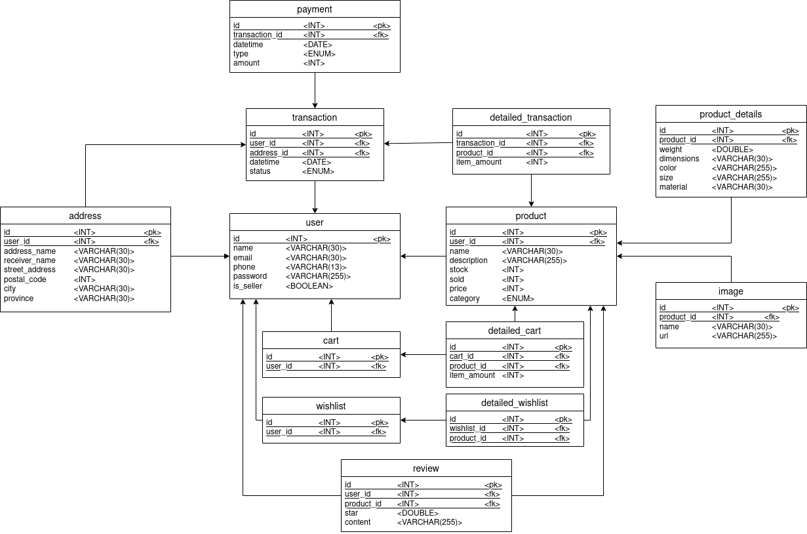

# Backend for Nusantara Store Project

## Study Case
Briefly, the study case is making a functional e-commerce web that has the minimum requirement stated in the problemset.

## Logical and Physical Data Model
Below are the data models for this project, both drawn using [drawio](https://app.diagrams.net/). To differentiate 'buyer' role and 'seller' role for the users table, ```is_seller``` attribute is added. The buyer and seller user is not separated because a seller can be a buyer too. Addresses for user is added in a separate table, because users in common e-commerce websites can have more than one address. The product details is created in a separate table from the product because it has too many attributes to include in the products table itself. The product can also have more than one image hence they are stored in a different table with one-to-many relation. <br/>

<br/>


<br/>

## Main Features in this Backend Project
- Using expressjs to provide server
- Using postgresql as the database and Sequelize as the ORM
- Using passportjs for the web user authentication
- Nodemailer is also installed and configured, but it is not implemented in the frontend side yet.
- In this project, all necessary services is added for each table. Even raw query like in carts services is added. But because of time and skill limitations, not all of the endpoints has been tested.

## Deployment
This backend is deployed using Digital Ocean's Ubuntu 20.04 virtual machine. It is connected to a postgresql database from Digital Ocean too. The IP address will be at [http://146.190.100.158:3001/](http://146.190.100.158:3001/)

## Constraints / Obstacles
- The main constraint will be finding a free deployment for ExpressJs server and database.
- Because of knowledge limitations, the server can connect to the database but it can't query initially. It's been resolved by using Digital Ocean's connection pool.
- Deployments on Digital Ocean works by occupying a virtual machine, so it may be difficult to non-linux users. When the server is run, it will be terminated when the cosole closes. It is resolved by using tmux. Tried using project manager but it throws error instead.